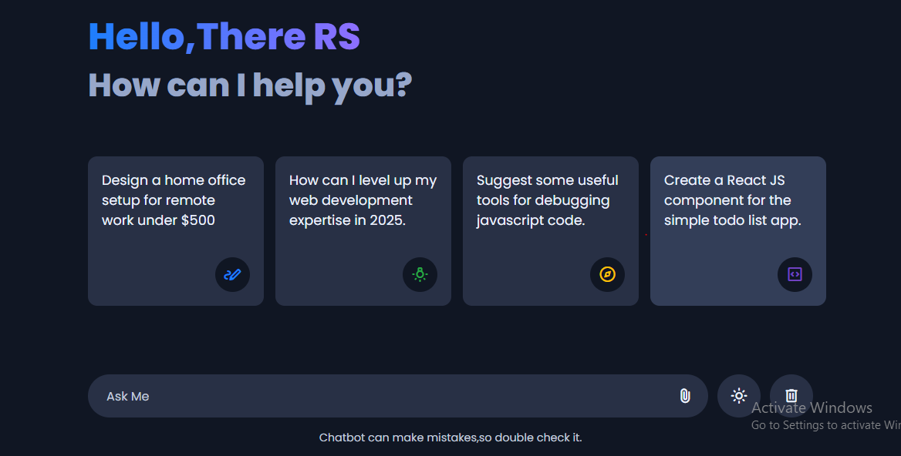
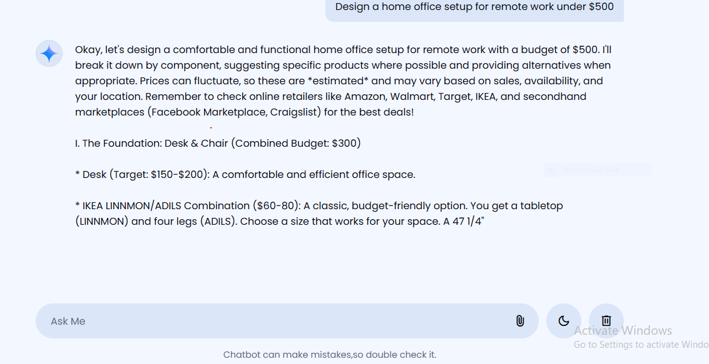

# Gemini Chatbot

A simple web-based chatbot interface powered by the Gemini API. This project allows users to interact with an AI assistant, send messages, upload files (images, PDFs, text, CSV), and switch between light and dark themes.

## Features

- Chat with an AI assistant using natural language.
- Upload and send images or files as part of your message.
- Quick suggestion prompts for easy conversation starters.
- Light and dark theme toggle.
- Delete chat history and stop bot responses.
- Responsive design for desktop and mobile devices.

## Getting Started

1. **Clone or Download the Repository**
2. Open `index.html` in your web browser.

> **Note:** You need a valid Gemini API key to use the chatbot. Replace the placeholder API key in `script.js` with your own.

## Project Structure

- `index.html` – Main HTML file for the chatbot UI.
- `style.css` – Stylesheet for layout and theming.
- `script.js` – JavaScript logic for chat functionality.
- `gemini-chatbot-logo.svg` – Bot avatar/logo.
- `ReadMe.md` – Project documentation.

## Screenshot

Add a screenshot of the website below:

